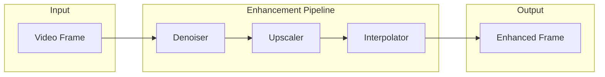

# AI Video Enhancement

This guide covers AI-powered video enhancement using the `transcode-ai` crate, including neural upscaling, denoising, and frame interpolation.

## Overview

The `transcode-ai` crate provides neural network-based video enhancement:

- **Super Resolution**: Upscale video 2x-4x using neural networks
- **Denoising**: Remove noise while preserving details
- **Frame Interpolation**: Generate intermediate frames for higher frame rates

## Architecture



## Quick Start

```rust
use transcode_ai::{EnhancementPipeline, PipelineConfig, ScaleFactor, NoiseLevel};

// Create a pipeline with upscaling and denoising
let config = PipelineConfig {
    enable_upscale: true,
    enable_denoise: true,
    ..Default::default()
};

let pipeline = EnhancementPipeline::new(config)?;

// Process a frame
let enhanced = pipeline.process_frame(&input_frame)?;
```

## Upscaling

### Scale Factors

| Factor | Output Size | Use Case |
|--------|-------------|----------|
| `X2` | 2x input | SD → HD upscaling |
| `X4` | 4x input | SD → 4K upscaling |

### Models

| Model | Quality | Speed | Best For |
|-------|---------|-------|----------|
| `RealESRGAN` | Highest | Slow | Final output, photography |
| `ESPCN` | Good | Fast | Real-time processing |
| `FSRCNN` | Good | Fast | Balanced quality/speed |
| `SwinIR` | Highest | Slowest | Maximum quality |
| `Anime4K` | Excellent | Medium | Animation content |

### Configuration

```rust
use transcode_ai::{Upscaler, UpscalerConfig, ScaleFactor, UpscaleModel};

let config = UpscalerConfig::default()
    .with_scale_factor(ScaleFactor::X2)
    .with_model(UpscaleModel::RealESRGAN)
    .with_tile_size(512)           // Process in tiles for large images
    .with_tile_overlap(32);        // Overlap to avoid seams

let upscaler = Upscaler::new(config)?;
let upscaled = upscaler.process(&frame)?;
```

### Tiled Processing

For large images that don't fit in GPU memory, enable tiled processing:

```rust
let config = UpscalerConfig::default()
    .with_tile_size(256)      // Smaller tiles for limited VRAM
    .with_tile_overlap(16);   // Blend overlap region
```

## Denoising

### Noise Levels

| Level | Sigma Range | Use Case |
|-------|-------------|----------|
| `Light` | σ < 15 | Clean sources with minor noise |
| `Medium` | σ 15-35 | Typical video noise |
| `Heavy` | σ > 35 | Very noisy footage |

### Models

| Model | Type | Best For |
|-------|------|----------|
| `DnCNN` | Blind denoising | Unknown noise levels |
| `FFDNet` | Non-blind | Known noise level |
| `NAFNet` | Restoration | Heavy degradation |
| `Restormer` | Transformer | Maximum quality |

### Configuration

```rust
use transcode_ai::{Denoiser, DenoiserConfig, NoiseLevel};

let config = DenoiserConfig::default()
    .with_noise_level(NoiseLevel::Medium)
    .with_detail_preservation(0.3)   // 0.0-1.0, higher = more detail
    .with_temporal(true);            // Use temporal consistency

let denoiser = Denoiser::new(config)?;
let denoised = denoiser.process(&frame)?;
```

### Temporal Denoising

For video sequences, enable temporal denoising to reduce flickering:

```rust
let config = DenoiserConfig::default()
    .with_temporal(true)
    .with_temporal_window(3);  // Use 3 frames for temporal filtering
```

## Frame Interpolation

Generate intermediate frames for smoother video (e.g., 30fps → 60fps).

### Modes

| Mode | Quality | Speed | Description |
|------|---------|-------|-------------|
| `Linear` | Low | Fastest | Simple blending |
| `MotionCompensated` | Medium | Fast | Block-based motion |
| `OpticalFlow` | High | Medium | Dense flow estimation |
| `Neural` | Highest | Slow | Deep learning models |

### Configuration

```rust
use transcode_ai::{FrameInterpolator, InterpolatorConfig, InterpolationMode};

let config = InterpolatorConfig::default()
    .with_multiplier(2)              // 2x frame rate (30→60fps)
    .with_mode(InterpolationMode::Neural)
    .with_scene_threshold(0.5);      // Detect scene changes

let interpolator = FrameInterpolator::new(config)?;
let frames = interpolator.interpolate(&frame1, &frame2, 0.5)?;
```

### Scene Change Detection

Avoid artifacts at scene boundaries:

```rust
let config = InterpolatorConfig::default()
    .with_scene_threshold(0.5)    // 0.0-1.0, lower = more sensitive
    .with_scene_blend(true);      // Blend instead of interpolate at scenes
```

## Enhancement Pipeline

Combine multiple enhancers with configurable processing order.

### Processing Order

| Order | Description | Best For |
|-------|-------------|----------|
| `DenoiseUpscaleInterpolate` | Denoise first (default) | Best quality |
| `UpscaleDenoiseInterpolate` | Upscale first | Preserves texture |

### Full Pipeline Example

```rust
use transcode_ai::{
    EnhancementPipeline, PipelineConfig, ProcessingOrder,
    UpscalerConfig, DenoiserConfig, InterpolatorConfig,
    ScaleFactor, NoiseLevel,
};

let config = PipelineConfig {
    enable_upscale: true,
    upscale_config: Some(UpscalerConfig::default()
        .with_scale_factor(ScaleFactor::X2)),

    enable_denoise: true,
    denoise_config: Some(DenoiserConfig::default()
        .with_noise_level(NoiseLevel::Light)),

    enable_interpolation: true,
    interpolation_config: Some(InterpolatorConfig::default()
        .with_multiplier(2)),

    order: ProcessingOrder::DenoiseUpscaleInterpolate,
};

let pipeline = EnhancementPipeline::new(config)?;

// Process video frames
for frame in video_frames {
    let enhanced = pipeline.process_frame(&frame)?;
    // Write enhanced frame
}
```

## Model Management

### Loading Models

```rust
use transcode_ai::{ModelLoader, ModelBackend};

// Load model with specific backend
let loader = ModelLoader::new(ModelBackend::CUDA)?;
let model = loader.load("models/realesrgan_x2.onnx")?;
```

### Backends

| Backend | Platform | Requirements |
|---------|----------|--------------|
| `CPU` | All | No special requirements |
| `CUDA` | NVIDIA | CUDA toolkit, cuDNN |
| `CoreML` | macOS/iOS | macOS 10.15+ |
| `DirectML` | Windows | Windows 10+ |

### Model Paths

Models are searched in order:
1. Explicit path provided
2. `TRANSCODE_MODEL_PATH` environment variable
3. `~/.transcode/models/`
4. System model directory

## Performance Optimization

### GPU Memory Management

```rust
// Process in smaller batches to reduce VRAM usage
let config = UpscalerConfig::default()
    .with_tile_size(256)
    .with_batch_size(1);
```

### CPU Fallback

When GPU is unavailable, traditional algorithms are used:

| AI Method | CPU Fallback |
|-----------|--------------|
| Neural upscaling | Lanczos interpolation |
| Neural denoising | Bilateral filter |
| Neural interpolation | Motion-compensated blending |

### Benchmarks

Typical performance on RTX 3080 (1080p → 4K upscaling):

| Model | Time/Frame | VRAM |
|-------|------------|------|
| RealESRGAN | 150ms | 4GB |
| ESPCN | 15ms | 1GB |
| FSRCNN | 20ms | 1GB |
| SwinIR | 500ms | 8GB |

## Integration with Pipeline

Use AI enhancement in a transcoding pipeline:

```rust
use transcode::{Transcoder, TranscodeOptions};
use transcode_ai::{EnhancementPipeline, ScaleFactor};

// Create enhancement pipeline
let enhancer = EnhancementPipeline::upscale_only(ScaleFactor::X2)?;

// Transcode with enhancement
let options = TranscodeOptions::new()
    .input("input.mp4")
    .output("output_4k.mp4")
    .on_frame(move |frame| {
        enhancer.process_frame(&frame)
    });

Transcoder::new(options)?.run()?;
```

## Error Handling

```rust
use transcode_ai::{AiError, Result};

match pipeline.process_frame(&frame) {
    Ok(enhanced) => { /* use enhanced frame */ }
    Err(AiError::ModelNotFound(path)) => {
        eprintln!("Model not found: {}", path);
        // Fall back to CPU processing
    }
    Err(AiError::OutOfMemory) => {
        eprintln!("GPU out of memory, reducing tile size");
        // Retry with smaller tiles
    }
    Err(e) => return Err(e.into()),
}
```

## Feature Flags

Enable AI features in `Cargo.toml`:

```toml
[dependencies]
transcode-ai = { version = "1.0", features = ["onnx", "gpu"] }
```

| Feature | Description |
|---------|-------------|
| `onnx` | ONNX Runtime for neural inference |
| `gpu` | GPU acceleration via `transcode-gpu` |

## Next Steps

- [GPU Acceleration](./gpu-acceleration.md) - Hardware acceleration
- [Quality Metrics](./quality-metrics.md) - Measure enhancement quality
- [Distributed Processing](./distributed-processing.md) - Scale across machines
