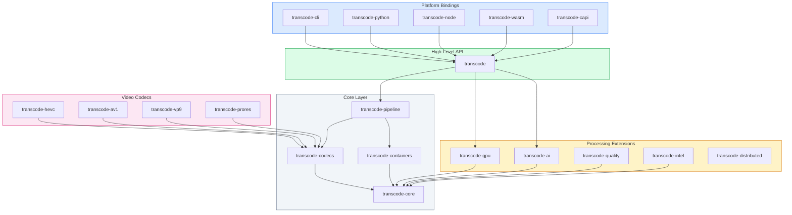
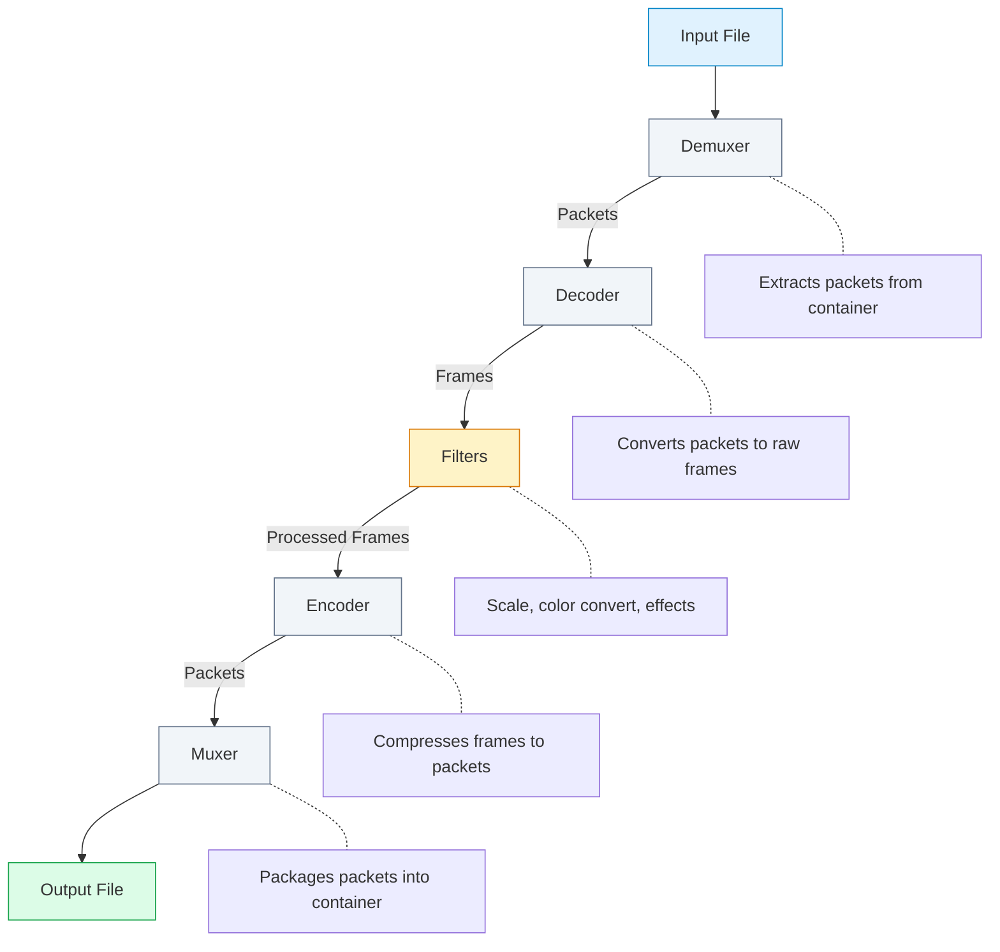

# Architecture

Transcode is built as a modular workspace with specialized crates for different functionality. This design enables flexibility, maintainability, and allows you to use only what you need.

## High-Level Overview

The architecture consists of several layers organized as a modular crate ecosystem:



The architecture consists of several layers:

1. **High-Level API** (`transcode`) - The main entry point for common use cases
2. **Core Layer** - Fundamental building blocks (core types, codecs, containers, pipeline)
3. **Processing Extensions** - Specialized capabilities (GPU, AI, quality metrics, distributed)
4. **Platform Bindings** - Language-specific interfaces (CLI, Python, Node.js, WASM, C)

## Crate Organization

### Core Layer

| Crate | Purpose |
|-------|---------|
| `transcode-core` | Fundamental types: frames, packets, timestamps, errors |
| `transcode-codecs` | Base codec implementations and traits |
| `transcode-containers` | Container format demuxers and muxers |
| `transcode-pipeline` | Pipeline orchestration and data flow |
| `transcode` | High-level facade API |

### Video Codecs

| Crate | Codec | Notes |
|-------|-------|-------|
| `transcode-codecs` | H.264/AVC | Built-in |
| `transcode-hevc` | H.265/HEVC | High efficiency |
| `transcode-av1` | AV1 | via rav1e/dav1d |
| `transcode-vp9` | VP9 | WebM compatible |
| `transcode-vp8` | VP8 | Legacy support |
| `transcode-prores` | ProRes | Professional |
| `transcode-dnxhd` | DNxHD/DNxHR | Avid workflows |

### Audio Codecs

| Crate | Codec | Notes |
|-------|-------|-------|
| `transcode-codecs` | AAC, MP3 | Built-in |
| `transcode-opus` | Opus | Best quality/size |
| `transcode-flac` | FLAC | Lossless |
| `transcode-ac3` | AC3/E-AC3 | Dolby Digital |
| `transcode-dts` | DTS | Surround sound |

### Processing

| Crate | Purpose |
|-------|---------|
| `transcode-gpu` | GPU compute via wgpu |
| `transcode-ai` | Neural enhancement |
| `transcode-quality` | PSNR, SSIM, VMAF metrics |
| `transcode-intel` | Content intelligence |
| `transcode-distributed` | Distributed processing |

### Platform Bindings

| Crate | Platform |
|-------|----------|
| `transcode-cli` | Command-line interface |
| `transcode-python` | Python (PyO3) |
| `transcode-node` | Node.js (N-API) |
| `transcode-wasm` | WebAssembly |
| `transcode-capi` | C API |

## Data Flow

A typical transcoding operation flows through these stages:



### Data Flow Summary

| Stage | Input | Output | Description |
|-------|-------|--------|-------------|
| **Demuxer** | File/Stream | Packets | Extracts compressed data from container |
| **Decoder** | Packets | Frames | Decompresses video/audio data |
| **Filters** | Frames | Frames | Transforms (scale, crop, effects) |
| **Encoder** | Frames | Packets | Compresses to target codec |
| **Muxer** | Packets | File/Stream | Writes to output container |

## Core Types

### Frame

Represents a decoded video frame:

```rust
pub struct Frame {
    pub width: u32,
    pub height: u32,
    pub pixel_format: PixelFormat,
    pub color_space: ColorSpace,
    pub timestamp: Timestamp,
    pub data: FrameBuffer,
}
```

### Packet

Represents encoded/compressed data:

```rust
pub struct Packet {
    pub data: Vec<u8>,
    pub pts: Timestamp,          // Presentation timestamp
    pub dts: Option<Timestamp>,  // Decode timestamp
    pub flags: PacketFlags,
    pub stream_index: usize,
}
```

### Timestamp

Handles time representation:

```rust
pub struct Timestamp {
    pub pts: i64,
    pub time_base: TimeBase,
}

impl Timestamp {
    pub fn as_seconds(&self) -> f64 {
        self.pts as f64 * self.time_base.num as f64 / self.time_base.den as f64
    }
}
```

## Codec Traits

All codecs implement common traits:

```rust
pub trait VideoDecoder {
    fn decode(&mut self, packet: &Packet) -> Result<Option<Frame>>;
    fn flush(&mut self) -> Result<Vec<Frame>>;
}

pub trait VideoEncoder {
    fn encode(&mut self, frame: &Frame) -> Result<Vec<Packet>>;
    fn flush(&mut self) -> Result<Vec<Packet>>;
}

pub trait CodecInfo {
    fn name(&self) -> &str;
    fn codec_type(&self) -> CodecType;
}
```

## Pipeline Architecture

The pipeline system connects components:

```rust
let pipeline = PipelineBuilder::new()
    .demuxer(Mp4Demuxer::new(input)?)
    .video_decoder(H264Decoder::new()?)
    .video_filter(ScaleFilter::new(1920, 1080))
    .video_encoder(H264Encoder::new(config)?)
    .muxer(Mp4Muxer::new(output)?)
    .build()?;

pipeline.run()?;
```

## Memory Management

Transcode uses several strategies for efficient memory use:

### Frame Pools

Pre-allocated frame buffers reduce allocation overhead:

```rust
let pool = FramePool::new(10, 1920, 1080, PixelFormat::Yuv420p);
let frame = pool.get()?;  // Reuses existing buffer
// ... use frame ...
drop(frame);  // Returns to pool
```

### Zero-Copy Where Possible

The `transcode-zerocopy` crate enables direct memory access without copying:

```rust
// GPU texture directly mapped to frame buffer
let texture = GpuTexture::from_frame(&frame)?;
```

## SIMD Optimization

Critical paths use SIMD instructions:

```rust
use transcode_codecs::detect_simd;

let caps = detect_simd();
// Automatically selects best implementation:
// - AVX-512 on modern Intel/AMD
// - AVX2 on older x86_64
// - NEON on ARM64
// - Scalar fallback otherwise
```

## Error Handling

Errors are categorized for appropriate handling:

```rust
pub enum Error {
    Io(std::io::Error),           // File/network issues
    Codec(CodecError),            // Encoding/decoding failures
    Container(ContainerError),    // Format issues
    Bitstream(BitstreamError),    // Parsing errors
    Pipeline(PipelineError),      // Pipeline configuration
}
```

## Thread Safety

- All codec instances are `Send` but not `Sync`
- Pipelines coordinate thread-safe access
- Distributed processing uses message passing

## Next Steps

- [Codecs & Containers](/docs/core-concepts/codecs-containers) - Supported formats
- [Frames & Packets](/docs/core-concepts/frames-packets) - Data types in depth
- [Pipeline](/docs/core-concepts/pipeline) - Pipeline configuration
