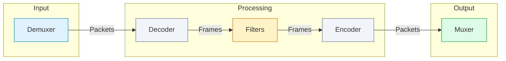
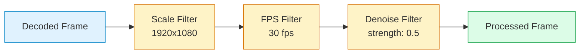
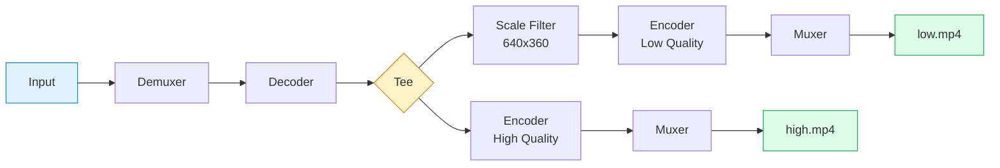
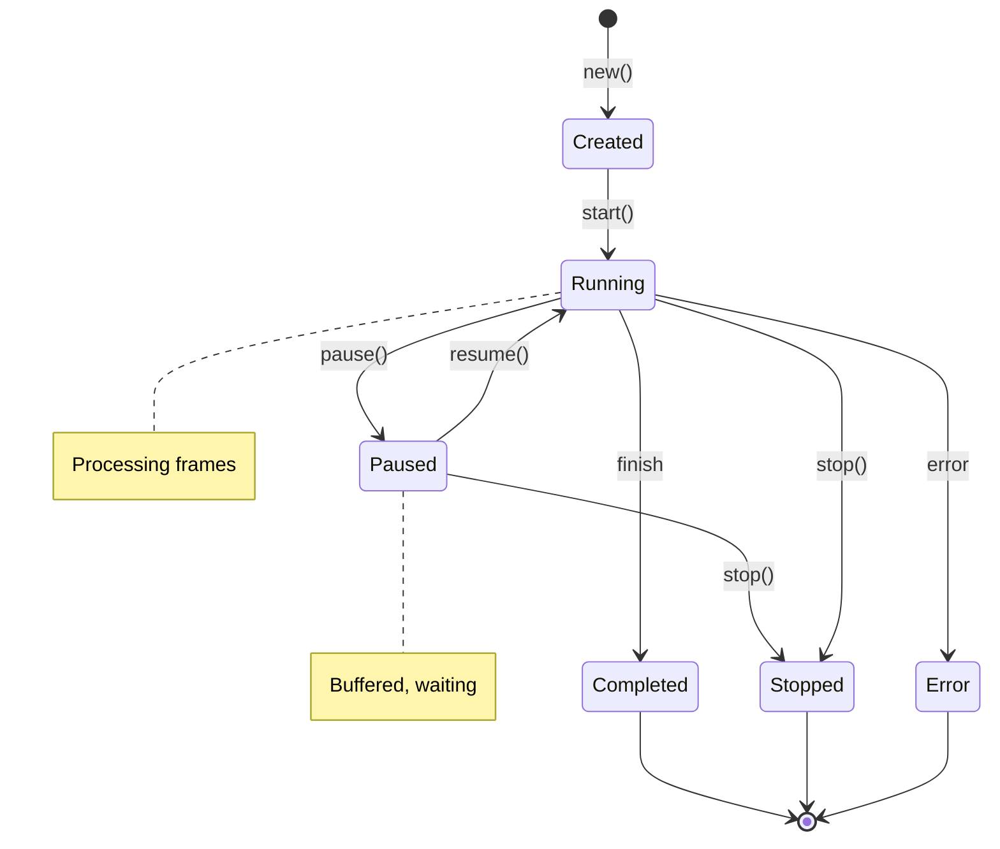

# Pipeline

The pipeline system connects demuxers, decoders, filters, encoders, and muxers into a processing chain.

## Pipeline Concept

A transcoding pipeline flows data through stages:



## Building a Pipeline

### Using PipelineBuilder

```rust
use transcode_pipeline::{
    PipelineBuilder, PipelineConfig,
    DemuxerWrapper, MuxerWrapper,
    VideoDecoderWrapper, VideoEncoderWrapper,
};
use transcode_containers::mp4::{Mp4Demuxer, Mp4Muxer};
use transcode_codecs::video::h264::{H264Decoder, H264Encoder};

let pipeline = PipelineBuilder::new()
    .demuxer(DemuxerWrapper::new(Mp4Demuxer::open("input.mp4")?))
    .video_decoder(VideoDecoderWrapper::new(H264Decoder::new()?))
    .video_encoder(VideoEncoderWrapper::new(H264Encoder::new(config)?))
    .muxer(MuxerWrapper::new(Mp4Muxer::create("output.mp4")?))
    .build()?;

pipeline.run()?;
```

### With Audio

```rust
use transcode_codecs::audio::aac::{AacDecoder, AacEncoder};

let pipeline = PipelineBuilder::new()
    .demuxer(DemuxerWrapper::new(Mp4Demuxer::open("input.mp4")?))
    // Video chain
    .video_decoder(VideoDecoderWrapper::new(H264Decoder::new()?))
    .video_encoder(VideoEncoderWrapper::new(H264Encoder::new(video_config)?))
    // Audio chain
    .audio_decoder(AudioDecoderWrapper::new(AacDecoder::new()?))
    .audio_encoder(AudioEncoderWrapper::new(AacEncoder::new(audio_config)?))
    // Output
    .muxer(MuxerWrapper::new(Mp4Muxer::create("output.mp4")?))
    .build()?;
```

## Filters

Filters process frames between decoding and encoding.

### Video Filters

```rust
use transcode_pipeline::{ScaleFilter, FpsFilter, VideoFilter};

let pipeline = PipelineBuilder::new()
    .demuxer(demuxer)
    .video_decoder(decoder)
    // Add filters
    .add_video_filter(ScaleFilter::new(1920, 1080))
    .add_video_filter(FpsFilter::new(30.0))
    .video_encoder(encoder)
    .muxer(muxer)
    .build()?;
```

### Available Video Filters

| Filter | Purpose | Example |
|--------|---------|---------|
| `ScaleFilter` | Resize video | `ScaleFilter::new(1920, 1080)` |
| `FpsFilter` | Change frame rate | `FpsFilter::new(30.0)` |
| `CropFilter` | Crop video | `CropFilter::new(100, 100, 1280, 720)` |
| `PadFilter` | Add padding | `PadFilter::new(1920, 1080)` |
| `RotateFilter` | Rotate video | `RotateFilter::new(90)` |
| `FlipFilter` | Mirror video | `FlipFilter::horizontal()` |

### Audio Filters

```rust
use transcode_pipeline::{VolumeFilter, ResampleFilter};

let pipeline = PipelineBuilder::new()
    // ...
    .add_audio_filter(VolumeFilter::new(0.8))  // 80% volume
    .add_audio_filter(ResampleFilter::new(48000))  // Resample to 48kHz
    // ...
    .build()?;
```

### Filter Chains

Process with multiple filters chained together:



```rust
use transcode_pipeline::FilterChain;

let video_chain = FilterChain::new()
    .add(ScaleFilter::new(1920, 1080))
    .add(FpsFilter::new(30.0))
    .add(DenoiseFilter::new(0.5));

let pipeline = PipelineBuilder::new()
    .video_filter_chain(video_chain)
    // ...
    .build()?;
```

### Custom Filters

Implement your own filter:

```rust
use transcode_pipeline::{VideoFilter, Frame, Result};

struct GrayscaleFilter;

impl VideoFilter for GrayscaleFilter {
    fn process(&mut self, frame: Frame) -> Result<Frame> {
        // Convert to grayscale by zeroing chroma planes
        let mut output = frame.clone();

        // Set U and V planes to 128 (neutral)
        for byte in output.plane_mut(1).iter_mut() {
            *byte = 128;
        }
        for byte in output.plane_mut(2).iter_mut() {
            *byte = 128;
        }

        Ok(output)
    }
}

// Use it
pipeline.add_video_filter(GrayscaleFilter);
```

## Synchronization

Keep audio and video in sync:

```rust
use transcode_pipeline::{Synchronizer, SyncConfig, SyncMode};

let sync_config = SyncConfig {
    mode: SyncMode::AudioMaster,
    max_drift_ms: 100,
    correction_factor: 0.1,
};

let pipeline = PipelineBuilder::new()
    .synchronizer(Synchronizer::new(sync_config))
    // ...
    .build()?;
```

### Sync Modes

| Mode | Description |
|------|-------------|
| `AudioMaster` | Audio timing is authoritative, video adjusts |
| `VideoMaster` | Video timing is authoritative, audio adjusts |
| `External` | Use external clock source |
| `Passthrough` | No synchronization (fastest) |

## Pipeline Configuration

Fine-tune pipeline behavior:

```rust
use transcode_pipeline::PipelineConfig;

let config = PipelineConfig {
    // Buffer sizes
    packet_queue_size: 100,
    frame_queue_size: 10,

    // Threading
    decode_threads: 4,
    encode_threads: 4,

    // Memory
    use_frame_pool: true,
    pool_size: 20,

    // Error handling
    error_recovery: true,
    max_consecutive_errors: 10,
};

let pipeline = PipelineBuilder::new()
    .config(config)
    // ...
    .build()?;
```

## Progress and Events

Monitor pipeline progress:

```rust
let pipeline = PipelineBuilder::new()
    // ...
    .on_progress(|progress| {
        println!("Progress: {:.1}%", progress.percent);
        println!("Frame: {}/{}", progress.current_frame, progress.total_frames);
        println!("FPS: {:.1}", progress.encoding_fps);
    })
    .on_error(|error| {
        eprintln!("Pipeline error: {}", error);
    })
    .build()?;
```

### Pipeline Events

```rust
use transcode_pipeline::PipelineEvent;

pipeline.run_with_events(|event| {
    match event {
        PipelineEvent::Started => println!("Pipeline started"),
        PipelineEvent::FrameDecoded(n) => println!("Decoded frame {}", n),
        PipelineEvent::FrameEncoded(n) => println!("Encoded frame {}", n),
        PipelineEvent::StreamFinished(idx) => println!("Stream {} finished", idx),
        PipelineEvent::Completed => println!("Pipeline completed"),
        PipelineEvent::Error(e) => eprintln!("Error: {}", e),
    }
})?;
```

## Multi-Output Pipeline

Output to multiple destinations simultaneously using the tee pattern:



```rust
use transcode_pipeline::TeeOutput;

let pipeline = PipelineBuilder::new()
    .demuxer(demuxer)
    .video_decoder(decoder)
    // Branch to multiple outputs
    .tee()
        // High quality output
        .output("high.mp4")
            .video_encoder(H264Encoder::new(high_config)?)
            .done()
        // Low quality output
        .output("low.mp4")
            .add_video_filter(ScaleFilter::new(640, 360))
            .video_encoder(H264Encoder::new(low_config)?)
            .done()
    .build()?;
```

## Seeking and Trimming

Process a specific range:

```rust
use transcode_pipeline::{SeekMode, Duration};

let pipeline = PipelineBuilder::new()
    // Start at 10 seconds
    .seek_to(Duration::from_secs(10), SeekMode::Keyframe)
    // Process for 30 seconds
    .duration(Duration::from_secs(30))
    // ...
    .build()?;
```

## Pipeline State

The pipeline follows a state machine for lifecycle management:



Check and control pipeline state:

```rust
use transcode_pipeline::PipelineState;

// Start pipeline
pipeline.start()?;

// Check state
match pipeline.state() {
    PipelineState::Running => println!("Pipeline is running"),
    PipelineState::Paused => println!("Pipeline is paused"),
    PipelineState::Completed => println!("Pipeline completed"),
    PipelineState::Error(e) => println!("Pipeline error: {}", e),
}

// Pause/resume
pipeline.pause()?;
pipeline.resume()?;

// Stop early
pipeline.stop()?;
```

## Next Steps

- [Basic Transcoding](/docs/guides/basic-transcoding) - Common pipeline patterns
- [Streaming Output](/docs/guides/streaming-output) - HLS/DASH pipelines
- [Distributed Processing](/docs/guides/distributed-processing) - Scale across workers
