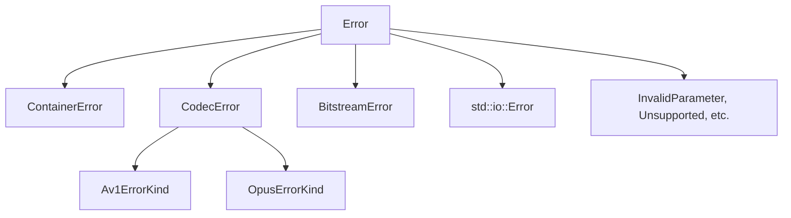

# Error Handling

This guide covers error handling patterns and best practices when using the Transcode library.

## Overview

Transcode provides a comprehensive error hierarchy that enables:

- **Precise error identification** - Know exactly what went wrong
- **Error context chaining** - Track where errors originated
- **Recovery support** - Determine if errors are recoverable
- **Type-safe handling** - Use Rust's pattern matching for specific cases

## Error Hierarchy



### Main Error Types

| Error Type | Description | Common Causes |
|------------|-------------|---------------|
| `ContainerError` | Demuxing/muxing errors | Corrupted files, invalid format |
| `CodecError` | Encoding/decoding errors | Unsupported profiles, bitstream issues |
| `BitstreamError` | Low-level parsing errors | Malformed data, unexpected EOF |
| `Io` | I/O operations | File not found, permission denied |
| `InvalidParameter` | Bad configuration | Invalid dimensions, bitrate |
| `Unsupported` | Feature not available | Unsupported codec/profile |

## Basic Error Handling

### Using the Result Type

```rust
use transcode_core::error::{Error, Result};

fn transcode_video(input: &str, output: &str) -> Result<()> {
    let decoder = Decoder::open(input)?;
    let encoder = Encoder::new(output)?;

    for packet in decoder.packets() {
        let frame = decoder.decode(packet?)?;
        encoder.encode(&frame)?;
    }

    encoder.finish()?;
    Ok(())
}
```

### Pattern Matching on Errors

```rust
use transcode_core::error::{Error, CodecError, ContainerError};

match transcode_video("input.mp4", "output.mp4") {
    Ok(()) => println!("Success!"),
    Err(Error::Container(ContainerError::UnknownFormat)) => {
        eprintln!("Unknown input format");
    }
    Err(Error::Codec(CodecError::UnsupportedProfile(profile))) => {
        eprintln!("Unsupported codec profile: {}", profile);
    }
    Err(Error::Io(io_err)) => {
        eprintln!("I/O error: {}", io_err);
    }
    Err(e) => {
        eprintln!("Error: {}", e);
    }
}
```

## Error Context

### Adding Context to Errors

Use the `ErrorContext` trait to add context as errors propagate:

```rust
use transcode_core::error::{Result, ErrorContext};

fn process_segment(segment: &VideoSegment) -> Result<()> {
    decode_frames(segment)
        .context("decoding segment")?;

    apply_filters(segment)
        .context("applying video filters")?;

    encode_output(segment)
        .context("encoding output")?;

    Ok(())
}

fn process_video(path: &str) -> Result<()> {
    for (i, segment) in segments.iter().enumerate() {
        process_segment(segment)
            .with_context(|| format!("processing segment {}", i))?;
    }
    Ok(())
}
```

### Lazy Context Evaluation

Use `with_context` when context computation is expensive:

```rust
// Context string is only built if there's an error
decoder.decode(packet)
    .with_context(|| format!("decoding frame {} at pts {}", frame_num, pts))?;
```

### Inspecting the Context Chain

```rust
fn report_error(err: &Error) {
    // Get all context messages
    let contexts = err.context_chain();

    println!("Error occurred:");
    for (i, ctx) in contexts.iter().enumerate() {
        println!("  {}: {}", i + 1, ctx);
    }

    // Get the root cause
    println!("Root cause: {}", err.root_cause());
}
```

## Recoverable Errors

Some errors allow processing to continue:

```rust
use transcode_core::error::Error;

fn decode_with_recovery(decoder: &mut Decoder) -> Result<Vec<Frame>> {
    let mut frames = Vec::new();

    loop {
        match decoder.decode_next() {
            Ok(frame) => frames.push(frame),
            Err(e) if e.is_eof() => break,
            Err(e) if e.is_recoverable() => {
                // Log and skip corrupted frame
                eprintln!("Skipping corrupted frame: {}", e);
                continue;
            }
            Err(e) => return Err(e),
        }
    }

    Ok(frames)
}
```

### Recoverable Error Types

| Error | Recovery Action |
|-------|-----------------|
| `BitstreamCorruption` | Skip to next keyframe |
| `MissingReference` | Request IDR frame |
| `InvalidSyntax` | Skip malformed element |

## Container Errors

### Common Container Errors

```rust
use transcode_core::error::ContainerError;

match demuxer.read_packet() {
    Err(Error::Container(ContainerError::InvalidStructure(msg))) => {
        // File structure is corrupted
        eprintln!("Corrupted container: {}", msg);
    }
    Err(Error::Container(ContainerError::MissingElement(name))) => {
        // Required atom/box missing
        eprintln!("Missing required element: {}", name);
    }
    Err(Error::Container(ContainerError::StreamNotFound { index })) => {
        // Requested stream doesn't exist
        eprintln!("Stream {} not found", index);
    }
    Err(Error::Container(ContainerError::SeekFailed(reason))) => {
        // Seek operation failed
        eprintln!("Cannot seek: {}", reason);
    }
    _ => {}
}
```

## Codec Errors

### Video Codec Errors

```rust
use transcode_core::error::CodecError;

match decoder.decode(&packet) {
    Err(Error::Codec(CodecError::UnsupportedProfile(profile))) => {
        eprintln!("Profile {} not supported, try re-encoding", profile);
    }
    Err(Error::Codec(CodecError::BitstreamCorruption { offset })) => {
        eprintln!("Bitstream corruption at offset {}", offset);
    }
    Err(Error::Codec(CodecError::MissingReference { frame_num })) => {
        eprintln!("Missing reference frame {}, requesting IDR", frame_num);
    }
    Err(Error::Codec(CodecError::DimensionsExceeded { width, height, .. })) => {
        eprintln!("Frame {}x{} too large for decoder", width, height);
    }
    _ => {}
}
```

### AV1-Specific Errors

```rust
use transcode_core::error::{CodecError, Av1ErrorKind};

match av1_encoder.encode(&frame) {
    Err(Error::Codec(CodecError::Av1(Av1ErrorKind::InvalidConfig(msg)))) => {
        eprintln!("Invalid AV1 config: {}", msg);
    }
    Err(Error::Codec(CodecError::Av1(Av1ErrorKind::NeedsMoreFrames))) => {
        // Encoder is buffering, continue feeding frames
    }
    Err(Error::Codec(CodecError::Av1(Av1ErrorKind::RateControlError(msg)))) => {
        eprintln!("Rate control issue: {}", msg);
    }
    _ => {}
}
```

### Opus-Specific Errors

```rust
use transcode_core::error::{CodecError, OpusErrorKind};

match opus_decoder.decode(&packet) {
    Err(Error::Codec(CodecError::Opus(OpusErrorKind::InvalidPacket(msg)))) => {
        eprintln!("Invalid Opus packet: {}", msg);
    }
    Err(Error::Codec(CodecError::Opus(OpusErrorKind::InvalidSampleRate(rate)))) => {
        eprintln!("Unsupported sample rate: {} Hz", rate);
    }
    Err(Error::Codec(CodecError::Opus(OpusErrorKind::PlcFailed(msg)))) => {
        // Packet loss concealment failed
        eprintln!("PLC failed: {}", msg);
    }
    _ => {}
}
```

## Bitstream Errors

```rust
use transcode_core::error::BitstreamError;

match parser.parse_header() {
    Err(Error::Bitstream(BitstreamError::UnexpectedEnd)) => {
        eprintln!("Incomplete data, need more bytes");
    }
    Err(Error::Bitstream(BitstreamError::InvalidStartCode { offset })) => {
        eprintln!("Invalid start code at offset {}", offset);
    }
    Err(Error::Bitstream(BitstreamError::InvalidSyntax { element, value })) => {
        eprintln!("Invalid {}: {}", element, value);
    }
    Err(Error::Bitstream(BitstreamError::ExpGolombOverflow)) => {
        eprintln!("Exp-Golomb value too large");
    }
    _ => {}
}
```

## Error Conversion

### From Standard Library Errors

```rust
use transcode_core::error::Error;

// std::io::Error automatically converts to Error
fn read_file(path: &str) -> Result<Vec<u8>> {
    let data = std::fs::read(path)?; // io::Error -> Error::Io
    Ok(data)
}
```

### Custom Error Types

```rust
use transcode_core::error::{Error, CodecError};

// Create errors from strings
let err: Error = CodecError::from("Custom codec error").into();

// Create specific error variants
let err = Error::invalid_param("bitrate must be positive");
let err = Error::unsupported("VP8 codec not implemented");
```

## Best Practices

### 1. Always Add Context at Boundaries

```rust
// Good: Context at function boundaries
fn transcode_file(input: &str, output: &str) -> Result<()> {
    open_input(input).context("opening input file")?;
    create_output(output).context("creating output file")?;
    // ...
}
```

### 2. Use Specific Error Types

```rust
// Good: Return specific error type
fn validate_dimensions(width: u32, height: u32) -> Result<()> {
    if width == 0 || height == 0 {
        return Err(Error::invalid_param("dimensions must be non-zero"));
    }
    if width > 8192 || height > 8192 {
        return Err(Error::Codec(CodecError::DimensionsExceeded {
            width, height,
            max_width: 8192, max_height: 8192,
        }));
    }
    Ok(())
}
```

### 3. Handle EOF Gracefully

```rust
fn read_all_packets(demuxer: &mut Demuxer) -> Result<Vec<Packet>> {
    let mut packets = Vec::new();

    loop {
        match demuxer.read_packet() {
            Ok(packet) => packets.push(packet),
            Err(e) if e.is_eof() => break, // Normal termination
            Err(e) => return Err(e),
        }
    }

    Ok(packets)
}
```

### 4. Log Before Returning

```rust
fn process(data: &[u8]) -> Result<Output> {
    match do_work(data) {
        Ok(output) => Ok(output),
        Err(e) => {
            tracing::error!(error = %e, "Processing failed");
            Err(e)
        }
    }
}
```

## Integration with anyhow/thiserror

### Using with anyhow

```rust
use anyhow::{Context, Result};

fn main() -> Result<()> {
    transcode("input.mp4", "output.mp4")
        .context("transcoding failed")?;
    Ok(())
}
```

### Using with thiserror

```rust
use thiserror::Error;
use transcode_core::error::Error as TranscodeError;

#[derive(Error, Debug)]
pub enum AppError {
    #[error("Transcode error: {0}")]
    Transcode(#[from] TranscodeError),

    #[error("Configuration error: {0}")]
    Config(String),
}
```

## Next Steps

- [Basic Transcoding](./basic-transcoding.md) - Getting started guide
- [Quality Metrics](./quality-metrics.md) - Measuring output quality
- [Distributed Processing](./distributed-processing.md) - Scaling across machines
