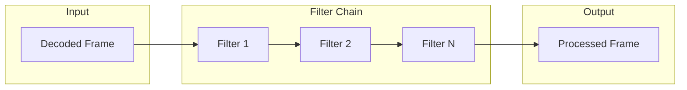

# Filter Chains

This guide covers video and audio filter chains in the Transcode library, including built-in filters, GPU-accelerated processing, and creating custom filters.

## Overview

Transcode provides a composable filter system that enables:

- **Video processing** - Scale, crop, color adjust, deinterlace
- **Audio processing** - Volume, normalize, resample
- **GPU acceleration** - Hardware-accelerated image processing
- **Custom filters** - Implement your own processing logic

## Architecture



## Filter Chain Basics

### Creating a Filter Chain

```rust
use transcode_pipeline::{FilterChain, VideoFilter, ScaleFilter, VolumeFilter};

// Create a video filter chain
let mut video_chain: FilterChain<dyn VideoFilter> = FilterChain::new();

// Add filters to the chain
video_chain.add(Box::new(ScaleFilter::new(1920, 1080)));

// Process frames through the chain
let output_frame = video_chain.process(input_frame)?;
```

### Processing Flow

```rust
// Frames flow through filters in order
for frame in decoder.frames() {
    // Each frame passes through all enabled filters
    let processed = video_chain.process(frame?)?;
    encoder.encode(&processed)?;
}

// Flush any buffered frames at the end
for frame in video_chain.flush()? {
    encoder.encode(&frame)?;
}
```

## Built-in Video Filters

### Scale Filter

Resize video frames to target dimensions:

```rust
use transcode_pipeline::ScaleFilter;

// Scale to 720p
let scale = ScaleFilter::new(1280, 720);

// Enable/disable at runtime
let mut scale = ScaleFilter::new(1920, 1080);
scale.set_enabled(true);
```

The scale filter uses nearest-neighbor interpolation for CPU processing. For higher quality scaling, use GPU filters.

### Null Filter

Pass-through filter useful for testing and conditional chains:

```rust
use transcode_pipeline::NullVideoFilter;

let null = NullVideoFilter::new();
// Frames pass through unchanged
```

## Built-in Audio Filters

### Volume Filter

Adjust audio levels with gain in decibels:

```rust
use transcode_pipeline::VolumeFilter;

// Increase volume by 6dB
let volume = VolumeFilter::new(6.0);

// Decrease volume by 3dB
let volume = VolumeFilter::new(-3.0);

// Adjust at runtime
let mut volume = VolumeFilter::new(0.0);
volume.set_gain_db(3.0);
```

### Null Audio Filter

Pass-through for audio:

```rust
use transcode_pipeline::NullAudioFilter;

let null = NullAudioFilter::new();
```

## GPU-Accelerated Filters

The `transcode-gpu` crate provides hardware-accelerated image processing:

### Scaling

High-quality GPU scaling with multiple algorithms:

```rust
use transcode_gpu::{GpuProcessor, ProcessorConfig, ScaleMode};

let processor = GpuProcessor::new(ProcessorConfig::default()).await?;

// Upload frame to GPU
let gpu_texture = processor.upload_rgba(&frame_data, width, height)?;

// Scale with different algorithms
let scaled = processor.scale(&gpu_texture, 3840, 2160, ScaleMode::Bilinear)?;
let scaled = processor.scale(&gpu_texture, 3840, 2160, ScaleMode::Bicubic)?;
let scaled = processor.scale(&gpu_texture, 3840, 2160, ScaleMode::Lanczos)?;

// Download result
let output_data = processor.download(&scaled)?;
```

### Scale Mode Comparison

| Mode | Quality | Speed | Best For |
|------|---------|-------|----------|
| `Nearest` | Low | Fastest | Pixel art, previews |
| `Bilinear` | Medium | Fast | Real-time processing |
| `Bicubic` | High | Medium | General use |
| `Lanczos` | Highest | Slower | Final output |

### Blur Filter

Apply Gaussian blur:

```rust
// Blur with radius 5 and sigma 1.5
let blurred = processor.blur(&gpu_texture, 5, 1.5)?;
```

### Sharpen Filter

Apply unsharp masking:

```rust
// Sharpen with strength 0.5 (0.0-1.0)
let sharpened = processor.sharpen(&gpu_texture, 0.5)?;
```

### Color Adjustment

Modify brightness, contrast, saturation, and gamma:

```rust
let adjusted = processor.color_adjust(
    &gpu_texture,
    1.1,   // brightness (+10%)
    1.2,   // contrast (+20%)
    0.9,   // saturation (-10%)
    1.0,   // gamma (neutral)
)?;
```

### Grayscale Conversion

```rust
let gray = processor.grayscale(&gpu_texture)?;
```

### GPU Filter Chain Example

```rust
use transcode_gpu::{GpuProcessor, ProcessorConfig, ScaleMode};

async fn process_frame(
    processor: &GpuProcessor,
    frame: &[u8],
    width: u32,
    height: u32,
) -> Result<Vec<u8>> {
    // Upload
    let texture = processor.upload_rgba(frame, width, height)?;

    // Chain GPU operations
    let scaled = processor.scale(&texture, 1920, 1080, ScaleMode::Bicubic)?;
    let sharpened = processor.sharpen(&scaled, 0.3)?;
    let adjusted = processor.color_adjust(&sharpened, 1.0, 1.1, 1.0, 1.0)?;

    // Download final result
    processor.download(&adjusted)
}
```

## Deinterlacing Filters

The `transcode-deinterlace` crate provides specialized filters for interlaced content:

### Available Algorithms

| Algorithm | Quality | Speed | Temporal | Description |
|-----------|---------|-------|----------|-------------|
| `Bob` | Low | Fast | No | Simple line doubling |
| `Linear` | Medium | Fast | No | Linear interpolation |
| `Bicubic` | Medium | Medium | No | Bicubic interpolation |
| `YADIF` | High | Medium | Yes | Motion-adaptive, 3-frame |
| `BWDIF` | Highest | Slow | Yes | Motion-adaptive, 5-frame |

### Basic Usage

```rust
use transcode_deinterlace::{YadifDeinterlacer, Deinterlacer};

let mut deint = YadifDeinterlacer::new();

// Process interlaced frames
for frame in interlaced_frames {
    let progressive = deint.process(frame)?;
    for output in progressive {
        // Use deinterlaced frame
    }
}

// Flush remaining frames
let remaining = deint.flush()?;
```

### Interlace Detection

Automatically detect if content is interlaced:

```rust
use transcode_deinterlace::{InterlaceDetector, ContentType, create_deinterlacer};

let mut detector = InterlaceDetector::new();

// Analyze sample frames
for frame in sample_frames.iter().take(15) {
    detector.analyze_frame(frame)?;
}

// Choose appropriate processing
match detector.get_content_type() {
    ContentType::Progressive => {
        // No deinterlacing needed
    }
    ContentType::Interlaced { field_order } => {
        let mut deint = create_deinterlacer(DeinterlaceAlgorithm::Yadif);
        // Process with deinterlacer
    }
    ContentType::Telecine { pattern, .. } => {
        // Use inverse telecine
    }
    _ => {
        // Unknown - use safe default
    }
}
```

### Inverse Telecine

Recover original film frames from telecined content:

```rust
use transcode_deinterlace::{InverseTelecine, TelecinePattern};
use transcode_deinterlace::bob::FieldOrder;

let mut ivtc = InverseTelecine::new(
    TelecinePattern::Pulldown32,
    FieldOrder::TopFieldFirst,
);

for frame in telecined_frames {
    let film_frames = ivtc.push_frame(frame)?;
    // Process recovered 24fps frames
}
```

## Custom Filters

### Implementing a Video Filter

```rust
use transcode_pipeline::{Filter, VideoFilter, Result};
use transcode_core::Frame;

/// Custom filter that inverts colors
pub struct InvertFilter {
    name: String,
    enabled: bool,
}

impl InvertFilter {
    pub fn new() -> Self {
        Self {
            name: "invert".to_string(),
            enabled: true,
        }
    }
}

impl Filter for InvertFilter {
    fn name(&self) -> &str {
        &self.name
    }

    fn is_enabled(&self) -> bool {
        self.enabled
    }
}

impl VideoFilter for InvertFilter {
    fn process(&mut self, mut frame: Frame) -> Result<Frame> {
        // Invert Y plane values
        if let Some(y_plane) = frame.plane_mut(0) {
            for pixel in y_plane.iter_mut() {
                *pixel = 255 - *pixel;
            }
        }
        Ok(frame)
    }

    fn flush(&mut self) -> Result<Vec<Frame>> {
        // No buffering, nothing to flush
        Ok(Vec::new())
    }
}
```

### Implementing an Audio Filter

```rust
use transcode_pipeline::{Filter, AudioFilter, Result};
use transcode_core::Sample;

/// Custom filter for fade in/out
pub struct FadeFilter {
    name: String,
    fade_samples: usize,
    samples_processed: usize,
    enabled: bool,
}

impl FadeFilter {
    pub fn new(fade_duration_samples: usize) -> Self {
        Self {
            name: "fade".to_string(),
            fade_samples: fade_duration_samples,
            samples_processed: 0,
            enabled: true,
        }
    }
}

impl Filter for FadeFilter {
    fn name(&self) -> &str {
        &self.name
    }

    fn is_enabled(&self) -> bool {
        self.enabled
    }
}

impl AudioFilter for FadeFilter {
    fn process(&mut self, mut sample: Sample) -> Result<Sample> {
        let data = sample.buffer_mut().data_mut();

        // Apply fade-in curve
        if self.samples_processed < self.fade_samples {
            let fade_factor = self.samples_processed as f32 / self.fade_samples as f32;

            // Process as S16 samples
            for chunk in data.chunks_exact_mut(2) {
                let value = i16::from_le_bytes([chunk[0], chunk[1]]);
                let faded = (value as f32 * fade_factor) as i16;
                chunk.copy_from_slice(&faded.to_le_bytes());
            }

            self.samples_processed += data.len() / 2;
        }

        Ok(sample)
    }
}
```

### Temporal Filters

Filters that need multiple frames implement buffering:

```rust
use transcode_pipeline::{Filter, VideoFilter, Result};
use transcode_core::Frame;

pub struct TemporalDenoiser {
    name: String,
    buffer: Vec<Frame>,
    window_size: usize,
}

impl TemporalDenoiser {
    pub fn new(window_size: usize) -> Self {
        Self {
            name: "temporal_denoise".to_string(),
            buffer: Vec::with_capacity(window_size),
            window_size,
        }
    }

    fn denoise_with_temporal(&self) -> Frame {
        // Average pixels across buffered frames
        // (implementation details omitted)
        self.buffer[self.window_size / 2].clone()
    }
}

impl Filter for TemporalDenoiser {
    fn name(&self) -> &str {
        &self.name
    }
}

impl VideoFilter for TemporalDenoiser {
    fn process(&mut self, frame: Frame) -> Result<Frame> {
        self.buffer.push(frame);

        if self.buffer.len() >= self.window_size {
            let output = self.denoise_with_temporal();
            self.buffer.remove(0);
            Ok(output)
        } else {
            // Return placeholder until buffer is full
            Ok(self.buffer.last().unwrap().clone())
        }
    }

    fn flush(&mut self) -> Result<Vec<Frame>> {
        // Return remaining buffered frames
        let remaining = std::mem::take(&mut self.buffer);
        Ok(remaining)
    }
}
```

## Pipeline Integration

### Using Filters in a Pipeline

```rust
use transcode_pipeline::{
    Pipeline, PipelineBuilder, PipelineConfig,
    FilterChain, VideoFilter, ScaleFilter,
};

// Create filter chain
let mut video_filters: FilterChain<dyn VideoFilter> = FilterChain::new();
video_filters.add(Box::new(ScaleFilter::new(1920, 1080)));

// Build pipeline with filters
let pipeline = PipelineBuilder::new()
    .config(PipelineConfig::default())
    .demuxer(demuxer)
    .decoder(0, video_decoder)
    .video_filter_chain(video_filters)
    .encoder(0, h264_encoder)
    .muxer(mp4_muxer)
    .build()?;

pipeline.run()?;
```

### Conditional Filtering

```rust
let mut chain: FilterChain<dyn VideoFilter> = FilterChain::new();

// Add filter based on input
if input_width != target_width || input_height != target_height {
    chain.add(Box::new(ScaleFilter::new(target_width, target_height)));
}

// Conditionally enable filters
let mut scale = ScaleFilter::new(1920, 1080);
scale.set_enabled(needs_scaling);
chain.add(Box::new(scale));
```

## Performance Tips

### 1. Order Matters

Process expensive filters last when possible:

```rust
// Good: Reduce resolution before heavy processing
let mut chain: FilterChain<dyn VideoFilter> = FilterChain::new();
chain.add(Box::new(ScaleFilter::new(720, 480)));  // Downscale first
chain.add(Box::new(ExpensiveFilter::new()));       // Process smaller frames
```

### 2. Use GPU for Heavy Operations

```rust
// CPU-bound filters
let scale = ScaleFilter::new(1920, 1080);  // OK for moderate use

// GPU-accelerated for heavy workloads
let gpu_processor = GpuProcessor::new(ProcessorConfig::default()).await?;
let scaled = gpu_processor.scale(&texture, 3840, 2160, ScaleMode::Lanczos)?;
```

### 3. Batch GPU Operations

```rust
// Good: Chain GPU operations before download
let scaled = processor.scale(&texture, 1920, 1080, ScaleMode::Bicubic)?;
let sharpened = processor.sharpen(&scaled, 0.3)?;
let output = processor.download(&sharpened)?;  // Single download

// Bad: Download between each operation
let scaled = processor.download(&processor.scale(&texture, 1920, 1080, mode)?)?;
let sharpened_tex = processor.upload_rgba(&scaled, 1920, 1080)?;
let sharpened = processor.download(&processor.sharpen(&sharpened_tex, 0.3)?)?;
```

### 4. Disable Unused Filters

```rust
let mut scale = ScaleFilter::new(1920, 1080);

// Check if scaling is actually needed
if input_width == 1920 && input_height == 1080 {
    scale.set_enabled(false);  // Skip processing
}
```

## Next Steps

- [GPU Acceleration](./gpu-acceleration.md) - Hardware acceleration details
- [AI Enhancement](./ai-enhancement.md) - Neural network-based filters
- [Quality Metrics](./quality-metrics.md) - Measuring filter effects
