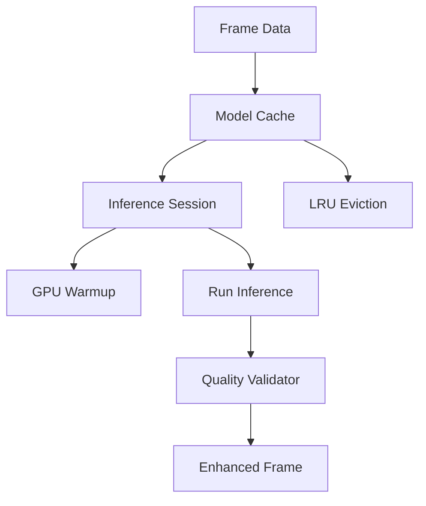

# GenAI Inference Engine

The `transcode-genai` crate includes a complete inference engine for running AI models with session management, LRU model caching, batch processing, and output quality validation.

## Overview

The inference engine manages the lifecycle of AI model sessions—from loading and warmup to batched frame processing:

```rust
use transcode_genai::inference::{
    InferenceSession, ModelCache, BatchInference, QualityValidator,
};
use transcode_genai::models::{ModelBackend, ModelPrecision};

// Create a model cache with 4GB limit
let mut cache = ModelCache::new(4 * 1024 * 1024 * 1024);

// Load a super-resolution model
cache.load_model("esrgan-4x", ModelBackend::ONNX, ModelPrecision::Fp16, 512_000_000)?;

// Get the session and warm it up
let session = cache.get_session_mut("esrgan-4x").unwrap();
session.warmup()?;

// Run inference
let input = vec![0.5f32; 1024]; // Normalized pixel data
let output = session.infer(&input)?;

println!("Output size: {} values", output.len());
println!("Avg latency: {} ms", session.avg_latency_ms());
```

## Quick Start

```toml
[dependencies]
transcode-genai = "1.0"
```

### Model Cache with LRU Eviction

The `ModelCache` automatically evicts least-recently-used models when memory is constrained:

```rust
use transcode_genai::inference::ModelCache;
use transcode_genai::models::{ModelBackend, ModelPrecision};

let mut cache = ModelCache::new(2 * 1024 * 1024 * 1024); // 2GB limit

// Load models — older ones evicted when cache is full
cache.load_model("esrgan", ModelBackend::ONNX, ModelPrecision::Fp16, 512_000_000)?;
cache.load_model("rife", ModelBackend::ONNX, ModelPrecision::Fp16, 256_000_000)?;
cache.load_model("u2net", ModelBackend::ONNX, ModelPrecision::Fp32, 300_000_000)?;

// Check memory usage
let (used, max) = cache.memory_usage();
println!("Memory: {} / {} bytes", used, max);

// List loaded models
for model_id in cache.loaded_models() {
    println!("  Loaded: {}", model_id);
}
```

### Batch Inference

Process multiple frames efficiently:

```rust
use transcode_genai::inference::BatchInference;

let inputs = vec![
    vec![0.5f32; 1024],  // Frame 0
    vec![0.6f32; 1024],  // Frame 1
    vec![0.7f32; 1024],  // Frame 2
];

let mut batch = BatchInference::new("esrgan".to_string(), 4);
let results = batch.process_batch(&mut cache, &inputs)?;

for result in &results {
    println!(
        "Frame {}: {} values, {} ms",
        result.frame_index,
        result.output.len(),
        result.latency_ms
    );
}
```

### Quality Validation

Compare inference output against a reference to ensure quality:

```rust
use transcode_genai::inference::{QualityValidator, ValidationResult};

let reference = vec![0.5f32; 1024]; // Expected output
let validator = QualityValidator::new(reference, 30.0); // 30 dB PSNR threshold

let output = session.infer(&input)?;
let result = validator.validate(&output);

println!("Passed: {}", result.passed);
println!("PSNR: {:.2} dB", result.psnr);
println!("Score: {:.4}", result.score);
```

## Architecture



## API Reference

| Type | Description |
|------|-------------|
| `InferenceSession` | Manages a loaded model with warmup and inference |
| `ModelCache` | LRU cache for multiple model sessions |
| `BatchInference` | Process multiple frames in a batch |
| `QualityValidator` | PSNR-based output quality validation |
| `InferenceResult` | Per-frame inference output with timing |
| `ValidationResult` | Quality check result (pass/fail, PSNR, score) |

## Next Steps

- [AI Enhancement](/docs/guides/ai-enhancement) — Neural upscaling and denoising
- [Quality Metrics](/docs/guides/quality-metrics) — PSNR, SSIM, VMAF assessment
