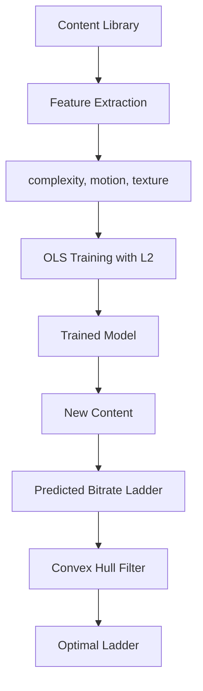

# ML Per-Title Encoding

The `transcode-pertitle-ml` crate provides machine learning-driven per-title encoding optimization. Train models on your content library to predict optimal bitrate ladders based on content complexity.

## Overview

Traditional encoding uses fixed bitrate ladders regardless of content. A talking-head video needs far less bitrate than an action scene. ML per-title encoding learns the relationship between content features and optimal encoding parameters.

```rust
use transcode_pertitle_ml::training::{
    TrainingDataset, TrainingSample, TrainingConfig,
    train, train_with_cv, convex_hull_optimize,
};

// Train a model on your content library
let dataset = TrainingDataset::generate_synthetic(1000);
let config = TrainingConfig::default();
let model = train(&dataset, &config);

println!("Model weights: {:?}", model.weights);
println!("Model bias: {:.4}", model.bias);
```

## Quick Start

```toml
[dependencies]
transcode-pertitle-ml = "1.0"
```

### Training a Bitrate Prediction Model

```rust
use transcode_pertitle_ml::training::*;

// Create training samples from your encoding runs
let samples = vec![
    TrainingSample {
        features: vec![0.8, 0.6, 0.9],  // [complexity, motion, texture]
        target: 5_000_000.0,             // optimal bitrate (bps)
    },
    TrainingSample {
        features: vec![0.2, 0.1, 0.3],
        target: 1_500_000.0,
    },
    TrainingSample {
        features: vec![0.5, 0.4, 0.5],
        target: 3_000_000.0,
    },
    // ... more samples from your content library
];

let dataset = TrainingDataset { samples };
let config = TrainingConfig {
    learning_rate: 0.01,
    epochs: 1000,
    l2_lambda: 0.001,   // L2 regularization
    ..Default::default()
};

let model = train(&dataset, &config);

// Predict optimal bitrate for new content
let new_content_features = vec![0.6, 0.3, 0.7];
let predicted_bitrate: f64 = model.weights.iter()
    .zip(&new_content_features)
    .map(|(w, f)| w * f)
    .sum::<f64>() + model.bias;

println!("Predicted optimal bitrate: {:.0} bps", predicted_bitrate);
```

### Cross-Validation

Evaluate model quality with k-fold cross-validation:

```rust
let config = TrainingConfig {
    learning_rate: 0.01,
    epochs: 500,
    l2_lambda: 0.001,
    ..Default::default()
};

let cv_result = train_with_cv(&dataset, &config, 5); // 5-fold CV

println!("Mean MSE: {:.4}", cv_result.mean_mse);
println!("Std MSE: {:.4}", cv_result.std_mse);
println!("Final model weights: {:?}", cv_result.model.weights);
```

### Convex Hull Optimization

Find the Pareto-optimal quality-bitrate points:

```rust
// Points: (bitrate, quality_score)
let encoding_points = vec![
    (1000.0, 30.0),
    (2000.0, 35.0),
    (3000.0, 38.0),
    (4000.0, 39.5),
    (5000.0, 40.0),
    (6000.0, 40.2),  // diminishing returns
];

let optimal = convex_hull_optimize(&encoding_points);
// Returns only the points on the efficiency frontier
for (bitrate, quality) in &optimal {
    println!("  {:.0} kbps → {:.1} dB", bitrate, quality);
}
```

## How It Works



1. **Feature extraction** — Analyze content for complexity, motion, and texture metrics
2. **Model training** — Ordinary Least Squares regression with L2 regularization
3. **Prediction** — Apply model to new content to predict optimal bitrates
4. **Convex hull** — Filter predictions to keep only Pareto-optimal points

## API Reference

| Type | Description |
|------|-------------|
| `TrainingSample` | Single training example (features + target) |
| `TrainingDataset` | Collection of samples with synthetic generation |
| `TrainingConfig` | Hyperparameters (learning rate, epochs, regularization) |
| `TrainedModel` | Trained weights and bias |
| `train()` | Train a model on a dataset |
| `train_with_cv()` | Train with k-fold cross-validation |
| `convex_hull_optimize()` | Find Pareto-optimal bitrate-quality points |

## Next Steps

- [Quality Metrics](/docs/guides/quality-metrics) — PSNR, SSIM, VMAF assessment
- [Basic Transcoding](/docs/guides/basic-transcoding) — Applying encoding parameters
