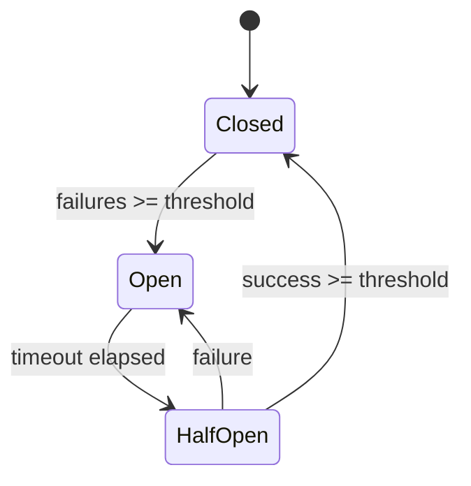

# Multi-Cloud Health Monitoring

The `transcode-multicloud` crate includes health monitoring with circuit breaker pattern, provider health probes, and cost estimation for comparing cloud provider pricing.

## Overview

When running transcoding across multiple cloud providers, you need resilient routing. The health monitoring module provides:

- **Circuit breaker** — Automatically route around failed providers
- **Health probes** — Track availability and latency per provider
- **Cost estimation** — Compare pricing across AWS, GCP, Azure

```rust
use transcode_multicloud::health::{
    CircuitBreaker, HealthMonitor, CostEstimator, ProviderPricing,
};
use std::time::Duration;

// Monitor provider health
let mut monitor = HealthMonitor::new(Duration::from_secs(30));
monitor.register_provider("aws-us-east");
monitor.register_provider("gcp-us-central");

// Record health check results
monitor.record_result("aws-us-east", true, 45);   // success, 45ms
monitor.record_result("gcp-us-central", true, 62); // success, 62ms

// Get healthy providers for routing
let healthy = monitor.healthy_providers();
println!("Healthy providers: {:?}", healthy);
```

## Circuit Breaker Pattern

The circuit breaker prevents cascading failures by temporarily removing unhealthy providers:



```rust
use transcode_multicloud::health::CircuitBreaker;
use std::time::Duration;

let mut breaker = CircuitBreaker::new(
    5,                          // Open after 5 failures
    3,                          // Close after 3 successes in half-open
    Duration::from_secs(30),    // Wait 30s before half-open
);

// Normal operation (Closed state)
assert!(breaker.is_available());

// Record failures
for _ in 0..5 {
    breaker.record_failure();
}

// Circuit is now Open — requests blocked
assert!(!breaker.is_available());

// After timeout, transitions to HalfOpen
// Successes in HalfOpen state close the circuit
breaker.record_success();
breaker.record_success();
breaker.record_success();
assert!(breaker.is_available()); // Back to Closed
```

### Health Probes

Track per-provider health with automatic circuit breaker integration:

```rust
use transcode_multicloud::health::HealthProbe;

let mut probe = HealthProbe::new("aws-us-east".to_string());

// Record health checks
probe.record_check(true, 45);   // success, 45ms latency
probe.record_check(true, 52);
probe.record_check(false, 0);   // failure

println!("Healthy: {}", probe.is_healthy());
println!("Availability: {:.1}%", probe.availability_percent());
```

## Cost Estimation

Compare provider pricing to route to the cheapest option:

```rust
use transcode_multicloud::health::{CostEstimator, ProviderPricing};

let mut estimator = CostEstimator::new();

estimator.set_pricing("aws", ProviderPricing {
    per_minute_video: 0.024,
    per_gb_storage: 0.023,
    per_gb_transfer: 0.09,
});

estimator.set_pricing("gcp", ProviderPricing {
    per_minute_video: 0.020,
    per_gb_storage: 0.020,
    per_gb_transfer: 0.08,
});

estimator.set_pricing("azure", ProviderPricing {
    per_minute_video: 0.022,
    per_gb_storage: 0.021,
    per_gb_transfer: 0.087,
});

// Estimate cost for a job: 60 min video, 10GB storage, 50GB transfer
let estimates = estimator.compare_all(60.0, 10.0, 50.0);
for est in &estimates {
    println!("{}: ${:.2} (compute: ${:.2}, storage: ${:.2}, transfer: ${:.2})",
        est.provider_id, est.total_cost,
        est.breakdown.compute, est.breakdown.storage, est.breakdown.transfer);
}

// Find cheapest
if let Some((provider, cost)) = estimator.cheapest_provider(60.0, 10.0, 50.0) {
    println!("Cheapest: {} at ${:.2}", provider, cost);
}
```

## API Reference

| Type | Description |
|------|-------------|
| `CircuitBreaker` | Three-state circuit breaker (Closed/Open/HalfOpen) |
| `CircuitState` | Current breaker state |
| `HealthProbe` | Per-provider health tracking with circuit breaker |
| `HealthMonitor` | Aggregate health monitoring for all providers |
| `ProviderStatus` | Provider health summary |
| `CostEstimator` | Multi-provider cost comparison |
| `ProviderPricing` | Per-minute, per-GB pricing model |
| `CostEstimate` | Total cost with breakdown |

## Next Steps

- [Distributed Processing](/docs/guides/distributed-processing) — Coordinator/worker architecture
- [Kubernetes Manifests](/docs/guides/kubernetes-manifests) — Deploy workers on K8s
