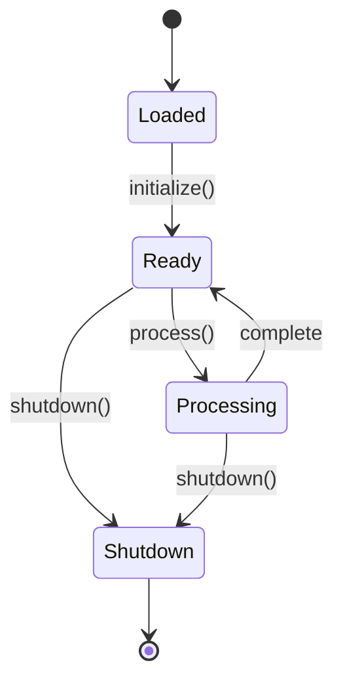
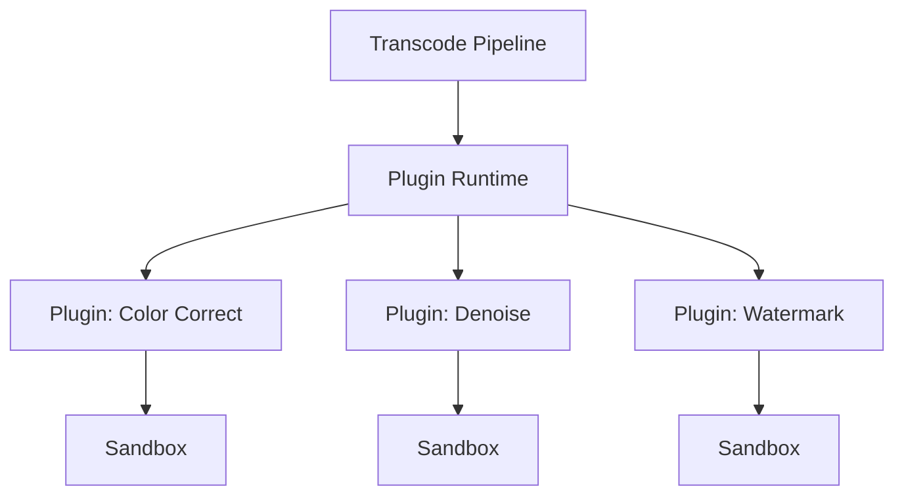

# Plugin Runtime

The `transcode-plugin` crate provides a runtime for loading, managing, and executing plugins with lifecycle management, sandboxed processing, and hot-reload capabilities.

## Overview

Extend Transcode's processing pipeline with custom plugins:

- **Lifecycle management** — Loaded → Ready → Processing → Shutdown state machine
- **Sandboxed execution** — Plugins process data in isolation
- **Hot reload** — Update plugins without restarting the pipeline
- **Statistics tracking** — Monitor plugin performance

## Quick Start

```toml
[dependencies]
transcode-plugin = "1.0"
```

### Loading and Running Plugins

```rust
use transcode_plugin::runtime::{PluginRuntime, PluginInstance};

// Create a plugin runtime
let mut runtime = PluginRuntime::new();

// Load plugins
runtime.load_plugin("color-correct", "/plugins/color_correct.wasm")?;
runtime.load_plugin("denoise", "/plugins/denoise.wasm")?;

// Initialize all plugins
runtime.initialize_all()?;

// Process data through a specific plugin
let input = vec![0u8; 1920 * 1080 * 3]; // RGB frame
let output = runtime.process("color-correct", &input)?;

println!("Processed {} bytes → {} bytes", input.len(), output.len());
```

### Plugin Lifecycle

Each plugin follows a strict state machine:



```rust
use transcode_plugin::runtime::PluginInstance;

let mut plugin = PluginInstance::new("my-filter", "/path/to/plugin.wasm");

// Lifecycle transitions
plugin.initialize()?;     // Loaded → Ready
let output = plugin.process(&data)?;  // Ready → Processing → Ready
plugin.shutdown()?;        // Ready → Shutdown
```

### Hot Reload

Update a plugin without stopping the pipeline:

```rust
// Reload with new version
runtime.hot_reload("color-correct", "/plugins/color_correct_v2.wasm")?;

// The plugin is re-initialized automatically
// Existing processing continues with the new version
let output = runtime.process("color-correct", &input)?;
```

### Plugin Statistics

Monitor plugin performance:

```rust
let stats = runtime.stats("color-correct");
if let Some(stats) = stats {
    println!("Invocations: {}", stats.invocations);
    println!("Total processing time: {:?}", stats.total_processing_time);
    println!("Avg latency: {:?}", stats.avg_processing_time());
    println!("Errors: {}", stats.errors);
}
```

## Architecture



## API Reference

| Type | Description |
|------|-------------|
| `PluginRuntime` | Manages multiple plugin instances |
| `PluginInstance` | Single plugin with lifecycle state |
| `PluginState` | Loaded, Ready, Processing, Shutdown |
| `PluginStats` | Invocation count, timing, error tracking |

## Next Steps

- [Custom Codecs](/docs/advanced/custom-codecs) — Build custom codec plugins
- [Filter Chains](/docs/guides/filter-chains) — Chain filters in a pipeline
