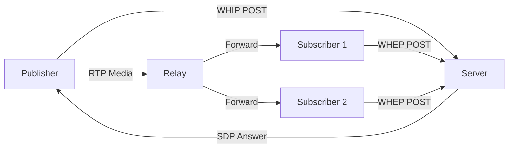

# WHIP/WHEP Real-Time Streaming

Transcode's WHIP (WebRTC-HTTP Ingestion Protocol) and WHEP (WebRTC-HTTP Egress Protocol) support enables real-time media ingestion and delivery over WebRTC, with a built-in media relay for connecting publishers to subscribers.

## Overview

The `transcode-whip` crate provides a complete WHIP/WHEP server with:

- **SDP negotiation** for WebRTC session establishment
- **ICE candidate trickle** for NAT traversal
- **Media relay** for pub/sub forwarding from WHIP publishers to WHEP subscribers
- **Session management** with automatic cleanup
- **Stream discovery** for listing active streams

## Quick Start

Add the dependency:

```toml
[dependencies]
transcode-whip = "1.0"
```

### Setting Up a Media Relay

The `MediaRelay` provides a publish/subscribe pattern for real-time media forwarding:

```rust
use transcode_whip::relay::{MediaRelay, RelayPacket, MediaType};

// Create a relay
let mut relay = MediaRelay::new();

// A publisher starts a stream
let stream_id = "live-camera-1";
relay.create_stream(stream_id);

// Subscribers connect
let (sub_id, mut receiver) = relay.subscribe(stream_id).unwrap();

// Publisher sends media
let packet = RelayPacket {
    media_type: MediaType::Video,
    payload: vec![0x00, 0x00, 0x01], // NAL unit data
    timestamp: 90000,
    sequence: 1,
};
relay.publish(stream_id, packet).unwrap();

// Subscriber receives media
if let Ok(packet) = receiver.try_recv() {
    println!("Received {} bytes of {:?}", packet.payload.len(), packet.media_type);
}
```

### Running a WHIP/WHEP Server

```rust
use transcode_whip::{WhipServer, ServerConfig};

#[tokio::main]
async fn main() -> Result<(), Box<dyn std::error::Error>> {
    let config = ServerConfig {
        bind_addr: "0.0.0.0:8080".parse()?,
        max_sessions: 100,
        session_timeout: std::time::Duration::from_secs(300),
    };

    let server = WhipServer::new(config);

    // WHIP endpoint: POST /whip → publish media
    // WHEP endpoint: POST /whep/{stream_id} → subscribe to stream
    // ICE trickle:   PATCH /session/{id} → add ICE candidates
    // List streams:  GET /streams → discover active streams

    server.run().await?;
    Ok(())
}
```

## Key Concepts

### Session Lifecycle

1. **Publisher** sends WHIP POST with SDP offer
2. Server creates session, returns SDP answer
3. ICE candidates are exchanged via PATCH
4. Media flows through the relay to all subscribers
5. WHEP clients connect by POSTing to the stream endpoint

### ICE Candidate Handling

Sessions support trickle ICE for efficient NAT traversal:

```rust
use transcode_whip::session::Session;

let mut session = Session::new("session-123", sdp_offer);

// Add ICE candidates as they arrive
session.add_ice_candidate("candidate:1 1 UDP 2122194687 192.168.1.1 50000 typ host");
session.add_ice_candidate("candidate:2 1 UDP 1686052607 203.0.113.1 50001 typ srflx");

// Check gathered candidates
println!("ICE candidates: {}", session.ice_candidates.len());
```

### Stream Statistics

Monitor relay performance:

```rust
let stats = relay.stats(stream_id);
if let Some(stats) = stats {
    println!("Subscribers: {}", stats.subscriber_count);
    println!("Packets forwarded: {}", stats.packets_forwarded);
    println!("Bytes forwarded: {}", stats.bytes_forwarded);
}
```

## Architecture



## Use Cases

- **Live camera ingestion** — Ingest from OBS, browsers, or mobile apps via WHIP
- **Low-latency distribution** — Sub-second delivery to multiple viewers via WHEP
- **Restreaming** — Forward incoming streams to multiple downstream consumers
- **Monitoring dashboards** — Real-time video preview in web UIs

## API Reference

| Struct | Description |
|--------|-------------|
| `MediaRelay` | Pub/sub media forwarding hub |
| `RelayPacket` | Media packet with type, payload, timestamp |
| `StreamRelay` | Per-stream state and subscriber management |
| `WhipServer` | HTTP server handling WHIP/WHEP endpoints |
| `Session` | WebRTC session with SDP and ICE state |

## Next Steps

- [Streaming Output](/docs/guides/streaming-output) — HLS/DASH output generation
- [Distributed Processing](/docs/guides/distributed-processing) — Scale across workers
